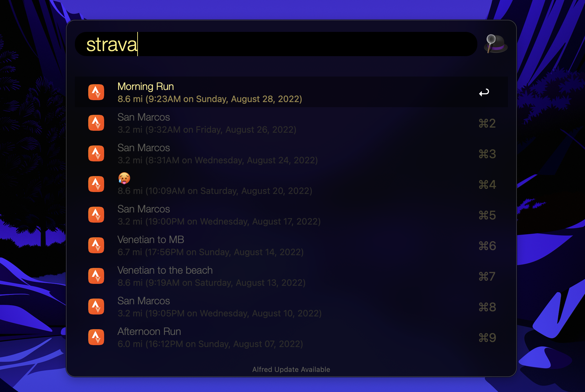

# Strava Workflow for Alfred

## Installation

Download [Strava.alfredworkflow](Strava.alfredworkflow) and open it in Alfred.

## Authentication

This workflow requires three environment variables to connect to Strava. These variables come from your Strava API Application which every Strava user has.

- `CLIENT_ID`
- `CLIENT_SECRET`
- `REFRESH_TOKEN`

### Follow these steps to get the values for these variables

1. Visit https://www.strava.com/settings/api and create an API application with the `scope` equal to "activity:read_all".

2. You will see the values for `CLIENT_ID` and `CLIENT_SECRET` on this page.

3. Click on the "OAuth Authorization page" link at the top of the "Update Application" section. Confirm that this link contains `scope=activity:read_all` in the URL parameters.

4. Click "Authorize".

5. Inspect the URL in the search bar and copy the value for `code`. This is the value for `REFRESH_TOKEN`.

6. That's it! Enter those values into the workflow configuration.

## Usage

The default keyword is "strava". After entering this keyword, hit 'return' and a list of your most recent Strava activites will appear. Selecting an activity will open it on strava.com in your default browser.

## Optional Parameters

To use metric units, set `METRIC_UNITS` to `true`.

## License

MIT